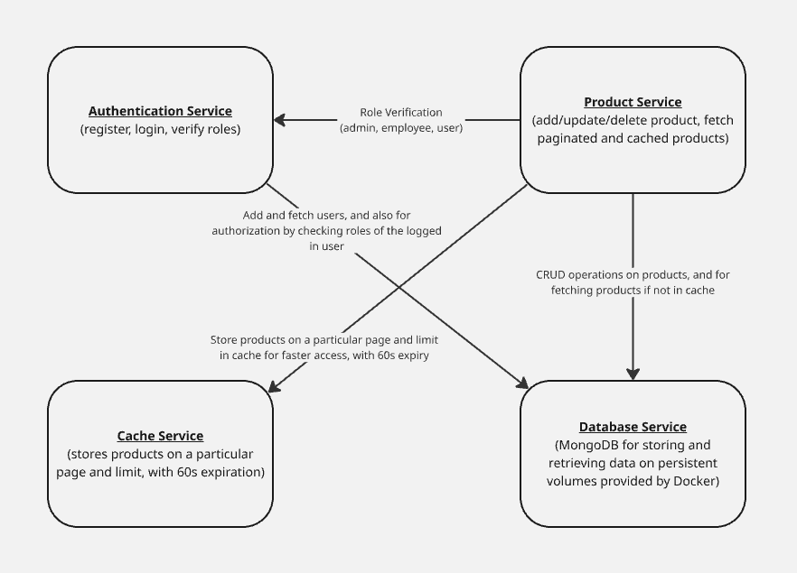

# E-Commerce Microservices Backend

## About the Project

This is a microservices-based e-commerce backend application designed with modularity and scalability in mind. Each service handles a distinct responsibility—user authentication, product management, data storage, and caching. Services communicate over HTTP and are containerized using Docker. Redis is used for caching frequently accessed product data, and MongoDB serves as the main database for both user and product data.

---

## Directory Structure

```
ecommerce-backend/
├── docker-compose.yml      # Orchestration of all services
├── .gitignore              # Ignore node_modules, .env, etc.
├── architecture-diagram.png
├── authentication/         # Authentication microservice
│ ├── db.js                 # MongoDB connection
│ ├── index.js              # Entry point for auth-service
│ ├── userModel.js          # Mongoose schema for users
│ ├── Dockerfile            # Dockerfile for auth-service
│ ├── package.json          # Node.js dependencies
│ └── .env                  # Auth-specific environment variables
│
├── product/                # Product microservice
│ ├── db.js                 # MongoDB connection
│ ├── index.js              # Entry point for product-service
│ ├── productModel.js       # Mongoose schema for products
│ ├── redis.js              # Redis client for caching
│ ├── Dockerfile            # Dockerfile for product-service
│ ├── package.json          # Node.js dependencies
│ └── .env                  # Product-specific environment variables
│
└── volumes/
└── mongo-data/             # Volume for MongoDB persistence
```

---

## Architecture Diagram



---

## Service Breakdown

### 1. Authentication Service (`auth-service`)

-   **Path:** `./authentication`
-   **Port:** `3000`
-   **Purpose:** Handles user registration, login, and role-based access control using JWT.

#### Endpoints:

-   `POST /register` — Register a new user (role: user, admin, or employee)
-   `POST /login` — Authenticate user and receive JWT
-   `POST /verify` — Verify JWT and retrieve user info
-   `POST /verifyRole` — Validate user roles for protected operations

#### Technologies:

-   MongoDB
-   Express.js
-   bcrypt
-   JWT

---

### 2. Product Service (`product-service`)

-   **Path:** `./product`
-   **Port:** `3001`
-   **Purpose:** Handles product CRUD operations with Redis caching.

#### Endpoints:

-   `GET /products` — Fetch paginated product list (with Redis caching)
-   `POST /product` — Add a new product (admin or employee only)
-   `PUT /update/:id` — Update a product (admin or employee only)
-   `DELETE /delete/:id` — Delete a product (admin or employee only)

#### Middleware:

-   `verifyRole` — Verifies the user's role with the `auth-service` before sensitive actions

#### Technologies:

-   MongoDB
-   Redis
-   Axios
-   Express.js

---

### 3. Database Service (`db-service`)

-   **Image:** Official `mongo`
-   **Port:** `27017`
-   **Purpose:** Provides centralized MongoDB access for both auth and product services
-   **Volume:** Uses named volume `mongo-data` for data persistence

---

### 4. Cache Service (`cache-service`)

-   **Image:** Official `redis`
-   **Port:** `6379`
-   **Purpose:** Caches product listings to improve performance and reduce MongoDB reads
-   **Usage:** Used in the `GET /products` endpoint of the product service with a 60-second TTL

---

## Docker Compose Overview

The entire system is orchestrated using Docker Compose. Each service runs in its own container and communicates through service names as hostnames.

### Service: `auth-service`

-   **Build:** From `./authentication`
-   **Port Mapping:** `3000:3000`
-   **Environment:** Loads from `.env`
-   **Volume:** Mounts the code directory for live code updates
-   **Depends On:** `db-service` (MongoDB)

### Service: `product-service`

-   **Build:** From `./product`
-   **Port Mapping:** `3001:3001`
-   **Environment:** Loads from `.env`
-   **Volume:** Mounts the code directory for live code updates
-   **Depends On:** `db-service`, `cache-service`

### Service: `db-service`

-   **Image:** `mongo`
-   **Port Mapping:** `27017:27017`
-   **Volume:** `mongo-data` for persistent storage

### Service: `cache-service`

-   **Image:** `redis`
-   **Port Mapping:** `6379:6379`

---

## How to Run

1.  **Clone the repository**

    ```bash
    git clone https://github.com/VatsalBhuva11/CEC_Services.git
    cd CEC_Services
    git checkout x86
    ```

2.  **Add the .env files**

    -   In `authentication/`, create a .env with the `PORT=3000` and `JWT_SECRET` environment variables.

        Example:

    ```bash
    PORT=3000
    JWT_SECRET=<your_jwt_secret>
    ```

    -   In `product/`, create a .env with the following environment variables.

        Example:

    ```bash
    PORT=3001
    REDIS_HOST=cache-service
    ```

3.  **Start the services**

    ```bash
    sudo docker-compose up
    ```

4.  **Access the APIs**
    -   `http://localhost:3000/` for the `authentication` service
    -   `http://localhost:3001/` for the `product` service

---

## Script for Kubernetes 

```bash
# Set docker env (if building inside Minikube)
minikube start

# Create namespace
kubectl apply -f k8s/namespace.yaml

# Deploy services
kubectl apply -f k8s/mongodb.yaml
kubectl apply -f k8s/redis.yaml
kubectl apply -f k8s/auth-service.yaml
kubectl apply -f k8s/product-service.yaml

# Apply autoscalers
kubectl apply -f k8s/auth-hpa.yaml
kubectl apply -f k8s/product-hpa.yaml

# Enable ingress
minikube addons enable ingress
kubectl apply -f k8s/ingress.yaml
minikube tunnel
```
**Access the APIs**
    -   `http://localhost/auth` for the `authentication` service
    -   `http://localhost/product` for the `product` service
